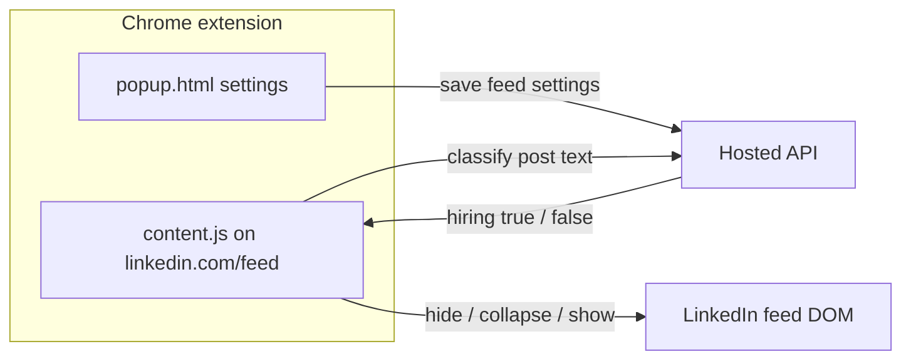

# LinkedIn Reader

A Chrome extension that filters your LinkedIn feed so you can focus on **hiring and recruiting posts**. Post text is classified automatically; you choose how non-hiring posts appear: fully hidden, collapsed behind a button, or shown with no filtering.

---

## Table of contents

- [How it works](#how-it-works)
- [Prerequisites](#prerequisites)
- [Install and run](#install-and-run)
- [Using the extension](#using-the-extension)
- [Feed filter modes](#feed-filter-modes)
- [Project structure](#project-structure)
- [Configuration](#configuration)
- [Troubleshooting](#troubleshooting)

---

## How it works



1. You sign in with Google from the extension popup.
2. On `https://www.linkedin.com/feed/*`, the content script reads each post’s text.
3. When filtering is enabled, each post is classified as hiring-related or not.
4. The extension applies your selected **feed filter mode** to non-hiring posts.

Settings are saved to your account and cached locally in `chrome.storage` so they persist across sessions.

---

## Prerequisites

| Requirement | Notes |
|-------------|--------|
| **Google Chrome** (or Chromium-based browser) | Extension is Manifest V3 |
| **LinkedIn account** | Feed filtering runs on the main feed URL |
| **Google account** | Sign-in uses Chrome Identity + Google OAuth |
| **Internet** | Sign-in and post classification require a network connection |

---

## Install and run

### 1. Get the code

Clone or download **this repository** (the extension source only):

```bash
git clone <repository-url>
cd <repository-folder>
```

### 2. Load the extension in Chrome

1. Open Chrome and go to `chrome://extensions/`.
2. Enable **Developer mode** (top right).
3. Click **Load unpacked**.
4. Select the folder that contains `manifest.json` (the root of the cloned repo).
5. Pin **LinkedIn Reader** from the extensions toolbar if you like.

### 3. Sign in and open LinkedIn

1. Click the extension icon → **Continue with Google**.
2. Complete Google sign-in when prompted.
3. Open [LinkedIn Feed](https://www.linkedin.com/feed/).
4. Open **Feed filters** in the popup and choose a mode (see below).

The content script only runs on URLs matching `https://www.linkedin.com/feed/*`.

---

## Using the extension

### Popup

- **Login** — Google sign-in; your session is stored locally as `accessToken`.
- **Dashboard** — Profile info and three toggles under **Feed filters**.
- **Logout** — Clears your local session and Google cached token.

### On the feed

- While a post is being classified, you may see a short **loading** bar on that post.
- **Non-hiring** posts are handled according to your mode (hidden message, collapse button, or full post).
- In **collapse** mode, click **Post from {author}** to expand and read the full post once.

Filtering requires you to be signed in.

---

## Feed filter modes

There are **three modes**, controlled by toggles in the popup:

| Mode | Popup toggle | Setting key | Behavior |
|------|----------------|-------------|----------|
| **1. Hide non-hiring** | Hide non-hiring posts | `hideNonHiringPosts: true` | Non-hiring posts are **removed from view** and replaced with a placeholder: “Non-hiring post hidden”. |
| **2. Collapse non-hiring** | Collapse non-hiring posts | `collapseNonHiringPosts: true` | Non-hiring posts are **replaced by a button** labeled `Post from {author}`. Click to reveal the full post. |
| **3. Show all (no filter)** | Show all posts | `showAllPosts: true` | **No filtering.** All posts render normally. |

### Defaults

New users default to **show all posts** enabled (`showAllPosts: true`, other flags `false`).

### How modes interact

- When **Show all posts** is **on**, modes 1 and 2 have no effect—the feed is unfiltered.
- When **Show all posts** is **off**, enable **either** hide **or** collapse (recommended). If both hide and collapse are on, **hide takes precedence** for non-hiring posts.
- **Hiring-related posts** always display normally in modes 1 and 2.

### Choosing a mode in the UI

1. Turn **off** “Show all posts” if you want filtering.
2. Turn **on** exactly one of:
   - “Hide non-hiring posts”, or
   - “Collapse non-hiring posts”.

Settings sync to your account and to `chrome.storage.local` so the content script updates without reloading the page.

---

## Project structure

```
├── manifest.json    # Extension manifest (MV3)
├── config.js        # API base URL
├── popup.html       # Login and settings UI
├── popup.js
├── content.js       # Feed scraping, filtering, DOM placeholders
├── style.css        # Popup styles
└── README.md
```

---

## Configuration

| File | What to change |
|------|----------------|
| `config.js` | API base URL (`API_BASE_URL`; default points to the hosted service) |
| `manifest.json` | Extension name, OAuth `client_id`, host permissions |

---

## Troubleshooting

| Issue | What to try |
|-------|-------------|
| Extension does nothing on LinkedIn | Confirm URL is `https://www.linkedin.com/feed/`. Reload the tab after installing. |
| Login fails or “Session expired” | Sign out and sign in again. Check your internet connection. |
| All posts hidden incorrectly | Sign in again, or switch to **Show all posts** temporarily. |
| Settings not applying | Open the popup while signed in and toggle a setting. In DevTools → Application → Extension storage, check `feedSettings`. |

---

## License

See repository metadata for license terms.
