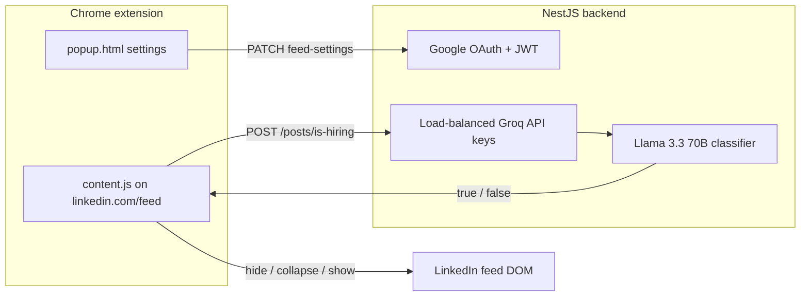

# LinkedIn Reader

A Chrome extension that filters your LinkedIn feed so you can focus on **hiring and recruiting posts**. Post text is sent to a backend API, which uses AI to classify each post. You choose how non-hiring posts appear: fully hidden, collapsed behind a button, or shown with no filtering.

---

## Table of contents

- [How it works](#how-it-works)
- [Prerequisites](#prerequisites)
- [Install and run the extension](#install-and-run-the-extension)
- [Optional: run the backend locally](#optional-run-the-backend-locally)
- [Using the extension](#using-the-extension)
- [Feed filter modes](#feed-filter-modes)
- [Backend and AI classification](#backend-and-ai-classification)
- [Project structure](#project-structure)
- [Configuration](#configuration)
- [Troubleshooting](#troubleshooting)

---

## How it works



1. You sign in with Google from the extension popup.
2. On `https://www.linkedin.com/feed/*`, the content script reads each post’s text.
3. For each post (when filtering is enabled), the extension calls `POST /posts/is-hiring` with the post text.
4. The backend runs an AI classifier and returns `{ isHiring: true | false }`.
5. The extension applies your selected **feed filter mode** to non-hiring posts.

Settings are stored on the server (MongoDB) and cached locally in `chrome.storage` so they persist across sessions.

---

## Prerequisites

| Requirement | Notes |
|-------------|--------|
| **Google Chrome** (or Chromium-based browser) | Extension is Manifest V3 |
| **LinkedIn account** | Feed filtering runs on the main feed URL |
| **Google account** | Sign-in uses Chrome Identity + Google OAuth |
| **Internet** | Classification calls the hosted API by default |

For **local backend development** you also need:

- Node.js 18+
- MongoDB (connection string in `.env`)
- Groq API key(s) configured in the backend (see [Optional: run the backend locally](#optional-run-the-backend-locally))

---

## Install and run the extension

### 1. Get the code

Clone or download this repository. The extension lives in the **`frontend`** folder:

```
extension-dddddddddddd/
├── frontend/          ← Chrome extension (load this folder)
└── linkedin-extension/ ← NestJS API (optional for local dev)
```

### 2. Point the extension at the API (if needed)

By default, the extension talks to the deployed API:

```js
// frontend/config.js
const API_BASE_URL = "https://feed-filters.vercel.app";
```

To use a **local** backend instead, comment the production URL and uncomment:

```js
const API_BASE_URL = "http://localhost:3001";
```

Make sure `manifest.json` `host_permissions` includes your API origin (localhost ports are already listed).

### 3. Load the extension in Chrome

1. Open Chrome and go to `chrome://extensions/`.
2. Enable **Developer mode** (top right).
3. Click **Load unpacked**.
4. Select the **`frontend`** directory (the folder that contains `manifest.json`).
5. Pin **LinkedIn Reader** from the extensions toolbar if you like.

### 4. Sign in and open LinkedIn

1. Click the extension icon → **Continue with Google**.
2. Complete Google sign-in when prompted.
3. Open [LinkedIn Feed](https://www.linkedin.com/feed/).
4. Open **Feed filters** in the popup and choose a mode (see below).

The content script only runs on URLs matching `https://www.linkedin.com/feed/*`.

---

## Optional: run the backend locally

Use this when developing the API or when you do not want to use the hosted deployment.

### 1. Install dependencies

```bash
cd linkedin-extension
npm install
```

### 2. Environment variables

Copy the example file and fill in your values:

```bash
cp .env.example .env
```

| Variable | Purpose |
|----------|---------|
| `MONGO_URI` | MongoDB connection string for users and settings |
| `PORT` | API port (e.g. `3001`; must match `config.js`) |
| `GOOGLE_CLIENT_ID` | Same OAuth client as in `manifest.json` |
| `JWT_SECRET` | Secret used to sign session tokens |

Groq API keys for classification are configured in the backend’s posts service (use environment variables or your own key rotation in production—do not commit secrets).

### 3. Start the server

```bash
# Development (watch mode)
npm run start:dev

# Or production build
npm run build
npm run start:prod
```

The API listens on `process.env.PORT` (default **3000** if unset; `.env.example` suggests **3001**).

### 4. Connect the extension

Set `API_BASE_URL` in `frontend/config.js` to `http://localhost:3001` (or your port), reload the extension on `chrome://extensions/`, and sign in again.

---

## Using the extension

### Popup

- **Login** — Google OAuth via Chrome Identity API; backend issues a JWT stored as `accessToken`.
- **Dashboard** — Profile info and three toggles under **Feed filters**.
- **Logout** — Clears local session and Google cached token.

### On the feed

- While a post is being classified, you may see a short **loading** bar on that post.
- **Non-hiring** posts are handled according to your mode (hidden message, collapse button, or full post).
- In **collapse** mode, click **Post from {author}** to expand and read the full post once.

Filtering requires a valid login so `POST /posts/is-hiring` can send the `Authorization: Bearer` header.

---

## Feed filter modes

There are **three modes**, controlled by toggles in the popup. They map to these settings:

| Mode | Popup toggle | Setting key | Behavior |
|------|----------------|-------------|----------|
| **1. Hide non-hiring** | Hide non-hiring posts | `hideNonHiringPosts: true` | Non-hiring posts are **removed from view** and replaced with a placeholder: “Non-hiring post hidden”. |
| **2. Collapse non-hiring** | Collapse non-hiring posts | `collapseNonHiringPosts: true` | Non-hiring posts are **replaced by a button** labeled `Post from {author}`. Click to reveal the full post. |
| **3. Show all (no filter)** | Show all posts | `showAllPosts: true` | **No classification or filtering.** All posts render normally; the extension does not call the classifier for filtering purposes. |

### Defaults

New users default to **show all posts** enabled (`showAllPosts: true`, other flags `false`).

### How modes interact

- When **Show all posts** is **on**, modes 1 and 2 have no effect—the feed is unfiltered.
- When **Show all posts** is **off**, enable **either** hide **or** collapse (recommended). If both hide and collapse are on, **hide takes precedence** for non-hiring posts.
- **Hiring-related posts** (classifier returns `true`) always display normally in modes 1 and 2.

### Choosing a mode in the UI

1. Turn **off** “Show all posts” if you want filtering.
2. Turn **on** exactly one of:
   - “Hide non-hiring posts”, or  
   - “Collapse non-hiring posts”.

Settings sync to the backend (`PATCH /auth/feed-settings`) and to `chrome.storage.local` so the content script updates without reloading the page.

---

## Backend and AI classification

The API (`linkedin-extension/`, NestJS) provides authentication, user profiles, persisted feed settings, and post classification.

### Classification endpoint

- **`POST /posts/is-hiring`** (JWT required)  
- **Body:** `{ "text": "<post body>" }`  
- **Response:** `{ "isHiring": boolean }`

The model is prompted to answer only `true` or `false`:

- **`true`** — Job openings, hiring, recruiting, etc.
- **`false`** — Everything else

Posts with **no extractable text** (e.g. image-only) are treated as non-hiring when filtering is active and follow your hide/collapse mode without calling the API.

### Load balancing between AI providers (Groq)

To handle volume and rate limits, the backend **rotates across multiple Groq API keys** (a pool of keys). Behavior:

1. **Round-robin** — Each request uses the next available key in the pool.
2. **429 handling** — If a key hits a rate limit, the service **automatically retries** with the next key.
3. **Daily token exhaustion** — Keys that hit Groq’s per-day token limit are **marked exhausted for the server session** and skipped until restart.
4. **Fallback** — If all keys fail or are exhausted, the API returns `{ isHiring: false }` (conservative: post may be hidden/collapsed depending on mode).

The classifier model used is **`llama-3.3-70b-versatile`** via the Groq SDK.

This design spreads traffic across keys so classification stays available under LinkedIn feed load without relying on a single API quota.

### Other API routes (reference)

| Method | Path | Description |
|--------|------|-------------|
| `POST` | `/auth/google` | Exchange Google access token for app JWT + user profile |
| `GET` | `/auth/me` | Current user + `feedSettings` |
| `PATCH` | `/auth/feed-settings` | Update one or more feed toggles |

Production deployment: **`https://feed-filters.vercel.app`** (see `vercel.json` in `linkedin-extension/`).

---

## Project structure

```
frontend/
├── manifest.json    # Extension manifest (MV3)
├── config.js        # API_BASE_URL
├── popup.html/js    # Login, settings UI
├── content.js       # Feed scraping, filtering, DOM placeholders
├── style.css        # Popup styles
└── README.md        # This file

linkedin-extension/
├── src/
│   ├── auth/        # Google login, JWT
│   ├── posts/       # is-hiring classifier + key rotation
│   └── users/       # Profiles and feedSettings in MongoDB
├── package.json
└── .env.example
```

---

## Configuration

| File | What to change |
|------|----------------|
| `frontend/config.js` | Backend URL (`API_BASE_URL`) |
| `frontend/manifest.json` | Extension name, OAuth `client_id`, host permissions |
| `linkedin-extension/.env` | MongoDB, port, JWT, Google client ID |

The extension OAuth `client_id` in `manifest.json` must match the Google Cloud OAuth client used by the backend (`GOOGLE_CLIENT_ID`).

---

## Troubleshooting

| Issue | What to try |
|-------|-------------|
| Extension does nothing on LinkedIn | Confirm URL is `https://www.linkedin.com/feed/` (with trailing path). Reload the tab after installing. |
| “Session expired” / login fails | Check `API_BASE_URL`, backend is running (if local), and Google OAuth client IDs match. |
| All posts hidden incorrectly | Backend may be down or rate-limited; check API logs. With no token, classifier is skipped and posts may show as hiring (`isHiring` defaults to visible). |
| Settings not applying | Open popup once while logged in; toggle a setting. Check DevTools → Application → Extension storage for `feedSettings`. |
| Local API CORS errors | Backend enables CORS for extension origins; ensure port in `config.js` matches `PORT` in `.env`. |

---

## License

See repository root or package metadata for license terms.
